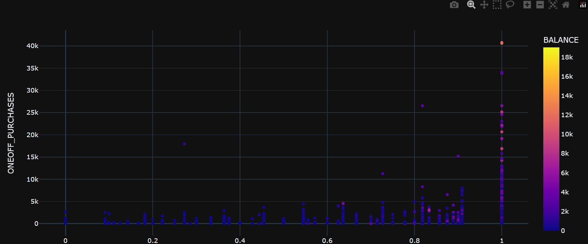
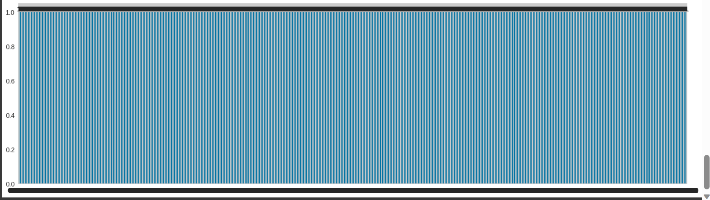
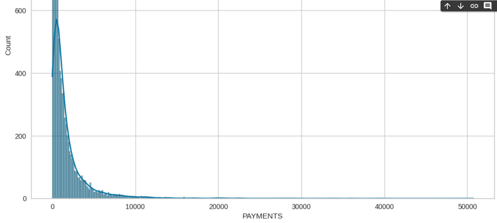
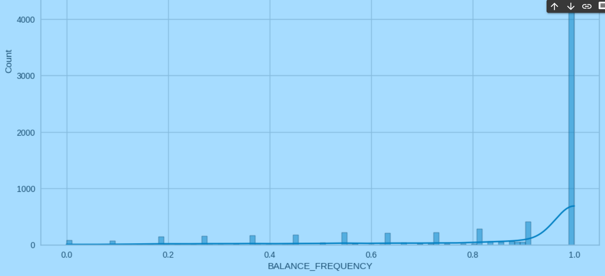
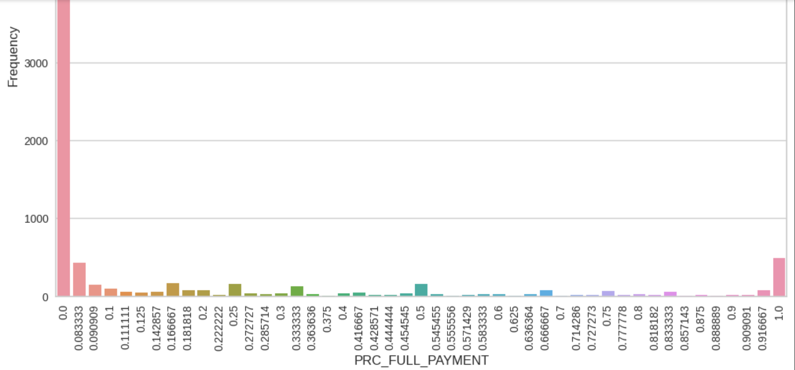
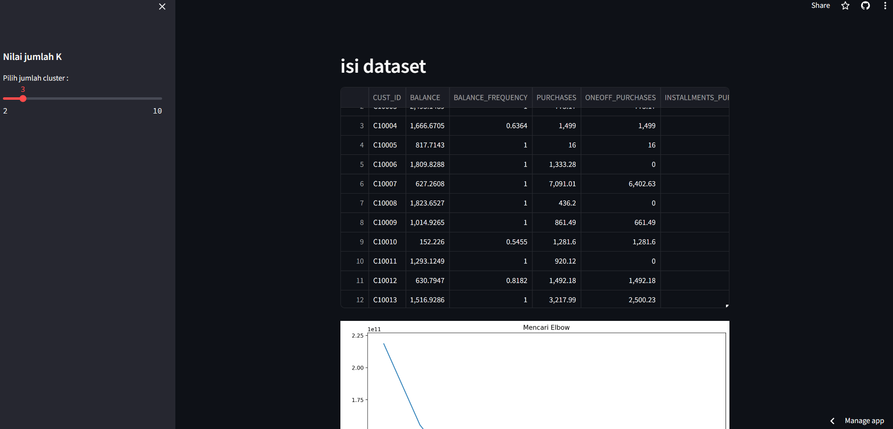

## Laporan Proyek Machine Learning

## Nama : zulfa salsabila adzkia

## Nim : 211351153

## Kelas : Pagi B

## Domain Proyek

Kasus ini untuk mengembangkan segmentasi pelanggan untuk menentukan strategi pemasaran. sampel Dataset merangkum perilaku penggunaan sekitar 9000 pemegang kartu kredit aktif selama 6 bulan terakhir. 

Menyertakan hasil riset terkait atau referensi. Referensi yang diberikan harus berasal dari sumber yang kredibel dan author yang jelas.

Format Referensi: https://www.researchgate.net/profile/Azad-Abdulhafedh/publication/349094412_Incorporating_K-means_Hierarchical_Clustering_and_PCA_in_Customer_Segmentation/links/601f494292851c4ed554724d/Incorporating-K-means-Hierarchical-Clustering-and-PCA-in-Customer-Segmentation.pdf 

##Business Understanding 

Pemahaman tentang bagaimana mengembangkan segmentasi pelanggan untuk menentukan strategi pemasaran untuk sebuah kartu kredit aktif.

Bagian Laporan ini mencakup :

## Problem Statements

Menjelaskan pernyataan masalah latar belakang :

* Bagaimana cara segmentasi nasabah untuk strategi marketing
##Goals 
Menjelaskan tujuan dari pernyataan masalah : 

* Untuk segmentasi nasabah dalam penerapan strategi marketing

Rubrik/Kriteria Tambahan (Opsional):

Menambahkan bagian “Solution Statement” yang menguraikan cara untuk meraih goals. Bagian ini dibuat dengan ketentuan sebagai berikut:

## Solution statements

* Pengembangan Platfrom segmentasi nasabah yang menggunakan kartu kredit untuk strategi marketing. Solusi pertama adalah mengembangkan platfrom yang mengintegrasikan segmentasi nasabah yang menggunakan kartu kredit dari Kaggle.com untuk memberikan pengguna akses cepat dan mudah ke informasi tentang segmentasi nasabah yang menggunakan kartu kredit untuk strategi marketing.
* Model yang dihasilkan dari dataset itu menggunakan metode KMeans.
## Data Understanding
Dataset yang saya gunakan berasal dari Kaggle yang berisi tentang Credit Card Dataset for Clustering

Contoh:https://www.kaggle.com/datasets/arjunbhasin2013/ccdata/data
## Variabel-variabel pada Credit Card dataset :
* CUST_ID : Identifikasi pemegang Kartu Kredit
* BALANCE : Jumlah saldo yang tersisa 
* BALANCE_FREQUENCY : Seberapa sering Saldo diperbarui
* PURCHASES : Jumlah pembelian yang dilakukan dari akun
* ONEOFF_PURCHASES : Jumlah pembelian maksimum yang dilakukan dalam sekali jalan
* INSTALLMENTS_PURCHASES : Jumlah pembelian yang dilakukan dengan mencicil
* CASH_ADVANCE : Uang muka yang diberikan oleh pengguna
* PURCHASES_FREQUENCY : Seberapa sering Pembelian dilakukan
* ONEOFFPURCHASESFREQUENCY :seberapa sering Pembelian terjadi
* PURCHASESINSTALLMENTSFREQUENCY : Seberapa sering pembelian dengan mencicil
## Data Preparation 
Untuk data collection saya mendapatkan dataset yang nantinya digunakan dari website kaggle dengan dataset Credit Card.Jika kalian tertarik dengan dataset ini anda bisa click pada link di atas.
## Data Discovery And Profolling 
Untuk bagian ini,kita akan menggunakan Teknik EDA. pertama kita mengimport semua library yang dibutuhkan.

    import numpy as np
    import pandas as pd
    from matplotlib import pyplot as plt
    import seaborn as sns
    import warnings
    import xgboost as xgb
    import plotly.express as px
    from sklearn.model_selection import train_test_split
    from sklearn.cluster import KMeans
    from sklearn.metrics import accuracy_score
    from sklearn.preprocessing import LabelEncoder, StandardScaler,PowerTransformer,MinMaxScaler, RobustScaler
    from sklearn.metrics import silhouette_samples, silhouette_score
    from sklearn.metrics import silhouette_score
    from yellowbrick.cluster import KElbowVisualizer
    warnings.filterwarnings("ignore")

Untuk melihat sebaran data pada dataset ini kita dapat memanggilnya dengan cara.

    def scatters(col1,col2):
    fig = px.scatter(df, x=col1, y=col2 , color="BALANCE", template = 'plotly_dark')
    return fig.show()

 EDA yang pertama 

    scatters('BALANCE_FREQUENCY', 'ONEOFF_PURCHASES')

EDA yang ke dua 

    plt.figure(figsize=(22,6))
    ax=df["CUST_ID"].value_counts().plot(kind="bar")
    plt.xticks(rotation=0, fontsize=12)
    plt.yticks(fontsize=12)
    ax.bar_label(ax.containers[0], label_type='edge')

EDA yang Ke Tiga 

    plt.figure(figsize=(12,8))
    sns.histplot(data=df,x=df.PAYMENTS,kde=True,stat='count')
    plt.show()  

EDA yang ke empat 

    plt.figure(figsize=(12,8))
    sns.histplot(data=df,x=df.BALANCE_FREQUENCY,kde=True,stat='count')
    plt.show() 

EDA yang ke lima 

    plt.figure(figsize=(12,8))
    sns.countplot(x="PRC_FULL_PAYMENT", data=df)
    plt.ylabel('Frequency', fontsize=12)
    plt.xlabel('PRC_FULL_PAYMENT', fontsize=12)
    plt.xticks(rotation='vertical')
    plt.title("Frekuensi pelunasan oleh nasabah dalam bentuk persen", fontsize=15)
    plt.show()

## Modeling
Sebelumnya mari kita import library yang nanti akan digunakan.

    from sklearn.model_selection import train_test_split
    from sklearn.metrics import accuracy_score
    x_train, X_test, y_train, y_test = train_test_split(x,y,random_state=90)
    y_test.shape

Langkah pertama adalah memasukan kolom-kolom fitur yang ada di dataset dan juga kolom targetnya.

    features = ['BALANCE', 'BALANCE_FREQUENCY', 'PURCHASES', 'ONEOFF_PURCHASES', 'CASH_ADVANCE', 'PAYMENTS', 'CASH_ADVANCE_FREQUENCY']
    x = df[features]
    y = df['TENURE']
    print(x.shape, y.shape)

Pemanggilan Model KMeans.

    model1 = KMeans()
    model1.fit(x_train)

    y_pred1 = model1.predict(X_test)

Hasil dari Silhouette Score.

    score = model1.fit(X_test, y_test)

    labels = model1.predict(X_test)
    silhouette_avg = silhouette_score(X_test, labels)
    print('Silhouette Score:', silhouette_avg)

##Evaluation
Menentukan jumlah Cluster

    n_clust = 4
    kmean = KMeans(n_clusters=n_clust).fit(x)
    x['Labels'] = kmean.labels_

Visualisasi Clustring

    plt.figure(figsize=(10,8))
    sns.scatterplot(x = x['BALANCE'], y = x['PAYMENTS'], hue=x['Labels'], markers=True, size=x['Labels'], palette=sns.color_palette('hls', n_clust))

    for label in x['Labels']:
    plt.annotate(label,
                (x[x['Labels']==label]['BALANCE'].mean(),
                    x[x['Labels']==label]['PAYMENTS'].mean()),
                    horizontalalignment = 'center',
                    verticalalignment = 'center',
                    size = 20, weight='bold',
                    color = 'black')

## Deployment
https://kmeans-zulfa-guaqosqneekbuk4shsgnxs.streamlit.app/

